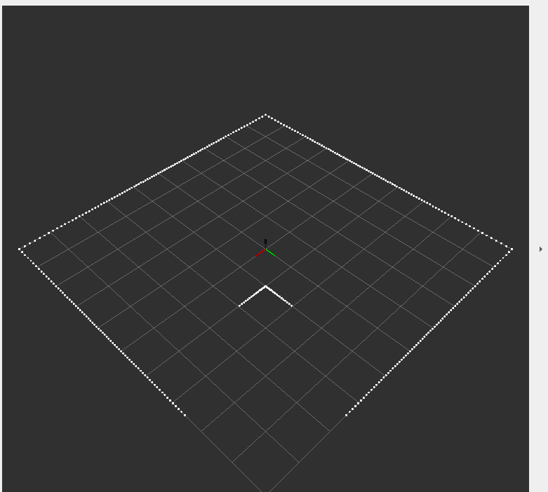
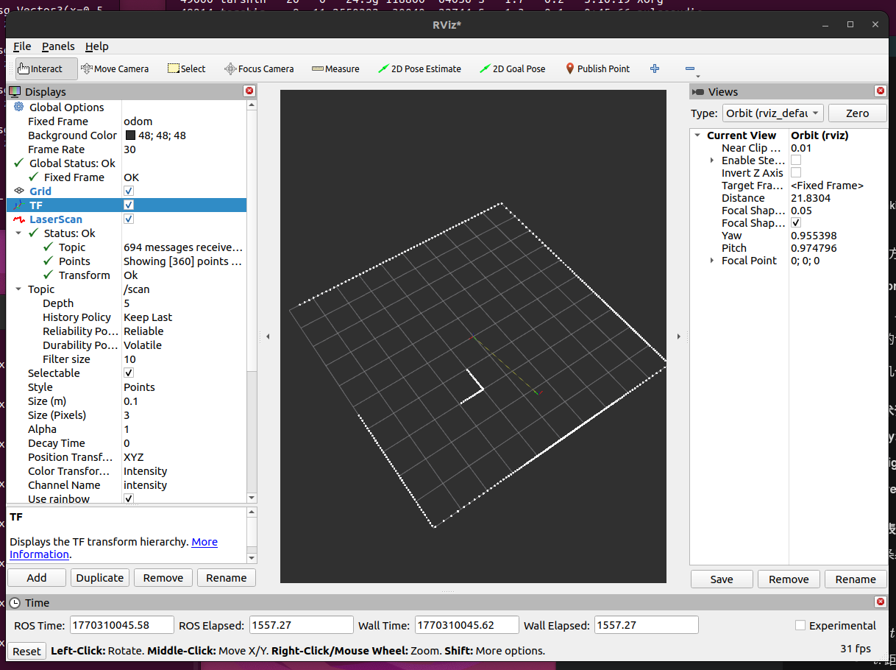
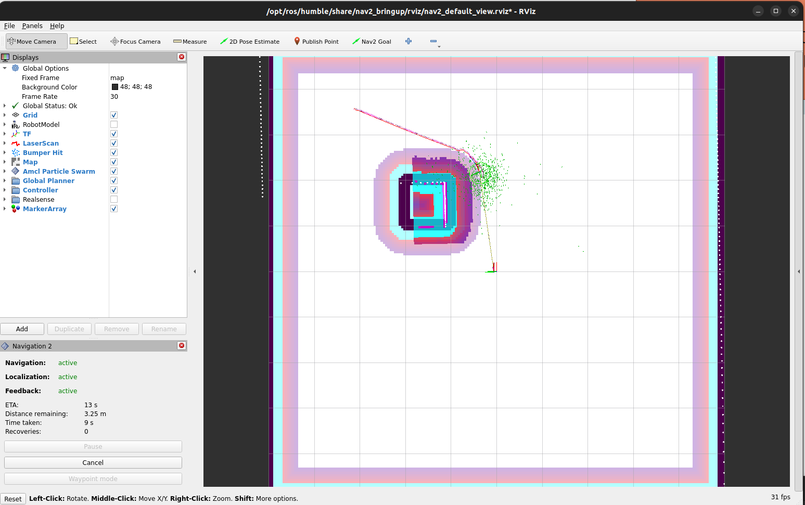
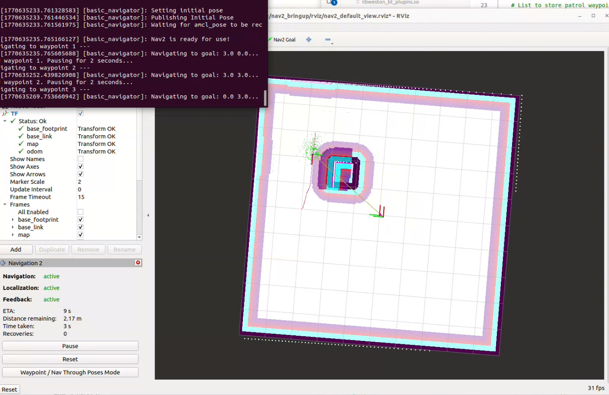

# Weston Robot AE Evaluation Project – Minimal Mobile Robot Autonomy (ROS2 Humble + Nav2 + BT)

A minimal (yet realistic) software-centric mobile robot autonomy system for patrolling in a known 2D environment.
It integrates:
- A lightweight 2D kinematics simulator (odom/tf/cmd_vel + lidar ray casting)
- Nav2 for planning & navigation execution
- Application-level mission behavior using Behavior Trees (custom + Nav2 nodes)
- Safety gating & failure injection for robustness testing (still working...)

> Focus: software architecture, robustness under failures, and reproducibility.

## 1. Requirements Coverage (Traceability)

This repository is built to satisfy the evaluation requirements:
- **Simulator**: publishes `/odom` + TF, consumes `/cmd_vel`, provides static map + obstacle representation, publishes sensor data usable by Nav2 (e.g. `/scan`)  
- **Nav2 integration**: global/local planning + execution, perfect/mildly noisy localization  
- **BT application behavior**: mission logic (loop patrol), progress monitoring, recovery escalation, safety gating, plus at least one configurable failure injection
- **Demos**: (1) normal mission execution (2) persistent obstacle / blocked path

## 2. Repository Structure

```text
.
├─ docker/
│ └─ ros_entrypoint.sh
├─ maps/
│ ├─ sim_map.yaml
│ ├─ sim_map.pgm
│ └─ generate_map.py
├─ src/
│ ├─ weston_sim_py/ # lightweight 2D simulator package
│ │ └─ weston_sim_py/
│ │ └─ simulator.py # publishes /odom, /tf, /scan; subscribes /cmd_vel
│ └─ weston_robot_cpp/ # Nav2 + BT orchestration & custom nodes
│ ├─ behavior_trees/
│ │ ├─ loop_bt.xml # BT for task3 loop
│ │ └─ loop_pure_bt.xml
│ ├─ config/
│ │ ├─ nav2_params.yaml # default 
│ │ └─ nav2_params_loop.yaml # for task3 loop
│ ├─ launch/
│ │ ├─ task2.launch.py 
│ │ ├─ task3_loop.launch.py # for task3 loop
│ │ ├─ task3_loop_pureBT.launch.py
│ │ └─ test_rviz.launch.py # test Rviz, easy for debug
│ └─ src/
│ ├─ nav2_client_node.cpp
│ ├─ inject_failure.cpp
│ ├─ start_loop_bt.cpp # set goals for task3 loop 
│ └─ loop_trigger.py
├─ Dockerfile
└─ README.md

```

## 3. Dependencies & Environment


The project is developed and tested with the following environment:

### System
- Ubuntu 22.04
- ROS 2 Humble

### ROS2 Packages
- tf2
- Nav2
  - `nav2_bringup`
  - `navigation2`

### Programming Languages
- Python 3 
  - numpy
  - pip
- C++ (custom BT nodes & integration)

---

## 4. Quick Start (Docker - Reproducible)

### 4.1 Build image
From repo root:
```bash
cd ~/Weston_SLAM_ws
docker build -t weston_slam_image . 
```

## 4.2 Run container 
```bash
docker run -it --rm weston_slam_image
```

## 4.3 Run container with GUI

```bash
# Allow Docker to access the X11 display:
xhost +local:docker

# Run container with GUI forwarding:
docker run -it --rm \
    --net=host \
    --env="DISPLAY" \
    --env="QT_X11_NO_MITSHM=1" \
    --volume="/tmp/.X11-unix:/tmp/.X11-unix:rw" \
    weston_slam_image
```


# 5. Quick Start (Local - colcon)
```bash
# from repo root (workspace root)
cd Weston_SLAM_ws
source /opt/ros/humble/setup.bash
colcon build --symlink-install
source install/setup.bash
```

# 6. Running the System
## 6.1 Task 1 – Simulator (2D Kinematics + Lidar)

This step launches the lightweight 2D simulator and verifies that:
- `/odom` and `/tf` are published correctly
- `/scan` (lidar) updates while the robot moves
- velocity commands from `/cmd_vel` drive the robot

### Terminal A – Start simulator

```bash
cd ~/Weston_SLAM_ws
source install/setup.bash
ros2 run weston_sim_py run_sim

```

### Terminal B - Launch RViz
```bash
ros2 run rviz2 rviz2
```

Then will be a black Rviz, need to do some settings
- Global Options → Fixed Frame: odom
- Add → TF
- Add → LaserScan


### Terminal C – Send velocity command
```bash
ros2 topic pub /cmd_vel geometry_msgs/msg/Twist "{linear: {x: 0.5}, angular: {z: 0.5}}"
```
The robot will run circle, then the laser scan will update while moving.



## 6.2 Task2 - Nav2 integration

This step integrates the simulator with the Nav2 stack to enable global planning,
local control, and goal execution.  
All required nodes are launched via a single launch file for simplicity and reproducibility.

The following components are started:

- Simulator (`/odom`, `/tf`, `/scan`)
- Nav2 bringup (planner, controller, behavior tree navigator)
- RViz visualization
```bash
cd ~/Weston_SLAM_ws
source install/setup.bash
ros2 launch weston_robot_cpp task2.launch.py
```
RViz will open automatically after launch. Configure RViz Interaction.

Use the following tools from the top toolbar:
- 2D Pose Estimate
- Set the robot's initial pose in the map (initial localization).


Now we can get the path planning.



## 6.3 Task3 - BT-based looping patrol
This step demonstrates application-level autonomy using a Behavior Tree (BT).
A looping patrol mission is executed where the robot repeatedly navigates
through a predefined set of waypoints.

The mission logic is implemented using Nav2 BT navigation together with
custom nodes. Waypoints (goals) are currently defined inside the Python
trigger script and can be modified as needed.

### Terminal A – Launch BT Navigation System

```bash
cd ~/Weston_SLAM_ws
source install/setup.bash
ros2 launch weston_robot_cpp task3_loop.launch.py 
```

This launch file starts:
- Simulator
- Nav2 stack
- Behavior Tree navigator
- RViz visualization

### Terminal B – Start Loop Patrol Script

```bash
cd ~/Weston_SLAM_ws
python3 src/weston_robot_cpp/src/start_loop_bt.py
```

**Expected Behavior**:
- The robot continuously navigates between predefined waypoints.
- The loop repeats indefinitely unless interrupted.




